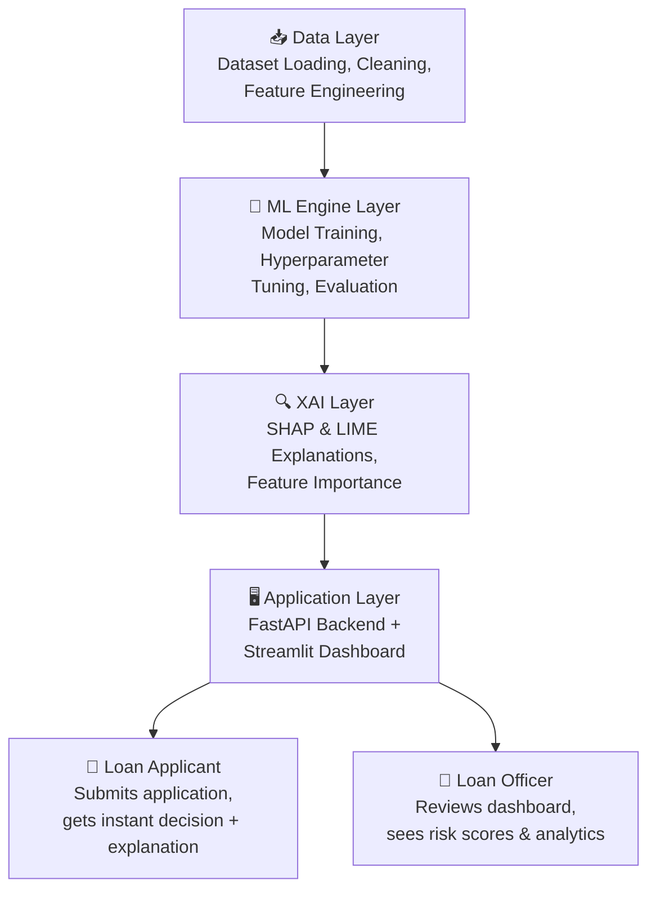
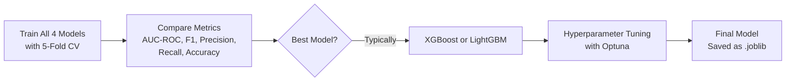

# AI-Based Loan Eligibility & Credit Decision System

## Capstone Project — Implementation Plan

**Project Title:** CreditLens AI — Intelligent Loan Eligibility & Credit Decision System with Explainable AI  
**Python Version:** 3.13  
**Package Manager:** uv  
**Date:** June 2026

---

## 1. Problem Statement

Traditional loan approval processes are manual, time-consuming, and prone to human bias. Banks and financial institutions need an automated, transparent, and fair system that can:

- **Predict** whether a loan applicant is eligible (Approved / Rejected)
- **Score** the applicant's creditworthiness on a risk scale (Low / Medium / High Risk)
- **Explain** the decision in human-readable terms (why approved/rejected, which factors mattered most)

> [!IMPORTANT]
> The system does **not** just predict — it also **explains**. This is critical for regulatory compliance (RBI Fair Lending Guidelines, Equal Credit Opportunity Act) and builds trust with end-users.

---

## 2. Overall Solution — How Are We Solving This?

### 2.1 High-Level Architecture (4-Layer Design)



### 2.2 Solution Flow (Step-by-Step)

| Step | What Happens | Technology |
|:-----|:-------------|:-----------|
| **1. Data Ingestion** | Load and validate the loan application dataset | Pandas, Pydantic |
| **2. Preprocessing** | Handle missing values, encode categoricals, scale numerics, engineer features | Scikit-learn, Pandas |
| **3. Class Balancing** | Handle imbalanced classes (more approvals than rejections) | SMOTE (imbalanced-learn) |
| **4. Model Training** | Train 4 ML models & compare performance | XGBoost, LightGBM, Random Forest, Logistic Regression |
| **5. Hyperparameter Tuning** | Optimize the best-performing model | Optuna |
| **6. Evaluation** | Measure accuracy, AUC-ROC, F1, Precision, Recall | Scikit-learn metrics |
| **7. Explainability** | Generate per-prediction and global explanations | SHAP, LIME |
| **8. API Deployment** | Serve the model via REST API | FastAPI |
| **9. Dashboard** | Interactive UI for applicants & loan officers | Streamlit |
| **10. Reporting** | Generate PDF/visual reports of decisions | Matplotlib, Plotly |

---

## 3. AI/ML Models — What We Build & Use

### 3.1 Models Used (Comparative Study)

We train **4 models** and conduct a comparative analysis to select the best-performing one. This is standard practice for academic capstone projects and demonstrates rigorous methodology.

| Model | Type | Why This Model? | Expected Strength |
|:------|:-----|:----------------|:-------------------|
| **XGBoost** | Gradient Boosted Trees | Industry gold standard for tabular credit data; robust regularization, handles missing values natively | Highest accuracy, best AUC-ROC |
| **LightGBM** | Gradient Boosted Trees | Faster training, leaf-wise growth, excellent for large datasets | Speed + low latency for real-time API |
| **Random Forest** | Bagging Ensemble | Strong baseline, less prone to overfitting, built-in feature importance | Stable, interpretable baseline |
| **Logistic Regression** | Linear Model | Classical statistical model for binary classification; fully interpretable | Benchmark + full transparency |

> [!NOTE]
> **We are building (training) our own models from scratch** on the dataset — not using pre-trained models or LLM APIs. This demonstrates core ML competency required for a capstone project.

### 3.2 Model Selection Strategy



### 3.3 Explainable AI (XAI) Layer

This is the **differentiating factor** of this project. We don't just predict — we explain.

| XAI Method | Scope | What It Does | Use Case in Our System |
|:-----------|:------|:-------------|:-----------------------|
| **SHAP** (SHapley Additive exPlanations) | Global + Local | Uses game-theory (Shapley values) to attribute each feature's contribution to the prediction | "Your loan was rejected because **Debt-to-Income ratio** contributed -0.35 to the score" |
| **LIME** (Local Interpretable Model-agnostic Explanations) | Local | Creates a local linear approximation around a single prediction | "What-If Analysis: If your income increases by ₹2L, the approval probability rises from 38% → 72%" |

**Visual outputs include:**
- SHAP Summary Plots (global feature importance)
- SHAP Waterfall Plots (per-applicant decision breakdown)
- SHAP Force Plots (interactive single-prediction view)
- LIME Explanation Tables (top contributing factors per prediction)

---

## 4. Dataset Strategy

### 4.1 Primary Dataset

We will use publicly available loan/credit datasets from Kaggle. Recommended options:

| Dataset | Records | Features | Source |
|:--------|:--------|:---------|:-------|
| **Loan Approval Prediction Dataset** | ~45,000 | 13 | Kaggle (Playground Series) |
| **Credit Risk Dataset** | ~32,000 | 12 | Kaggle |
| **Home Credit Default Risk** | ~300,000+ | 120+ | Kaggle Competition |

### 4.2 Feature Categories

| Category | Example Features |
|:---------|:-----------------|
| **Demographics** | Age, Gender, Marital Status, Education Level, Number of Dependents |
| **Financial** | Annual Income, Employment Status, Employment Length (years) |
| **Credit History** | CIBIL/Credit Score, Number of Open Accounts, Previous Defaults |
| **Loan Details** | Loan Amount, Loan Term, Loan Purpose, Interest Rate |
| **Assets** | Residential Asset Value, Commercial Asset Value, Bank Asset Value |
| **Engineered Features** | Debt-to-Income Ratio, Loan-to-Income Ratio, Income-per-Dependent |

### 4.3 Target Variable

- **`loan_status`**: Binary → `1` (Approved) / `0` (Rejected)

---

## 5. Project Directory Structure

```
capstone-project/
├── pyproject.toml              # uv project config with dependencies
├── requirements.txt            # Pinned dependency versions
├── .python-version             # Python 3.13
├── README.md                   # Project overview & setup instructions
│
├── data/
│   ├── raw/                    # Original dataset (CSV)
│   └── processed/              # Cleaned & feature-engineered dataset
│
├── notebooks/
│   ├── 01_eda.ipynb            # Exploratory Data Analysis
│   ├── 02_preprocessing.ipynb  # Data cleaning & feature engineering
│   ├── 03_model_training.ipynb # Model training & comparison
│   ├── 04_evaluation.ipynb     # Metrics, ROC curves, confusion matrices
│   └── 05_explainability.ipynb # SHAP & LIME analysis
│
├── src/
│   ├── __init__.py
│   ├── config.py               # Project settings & paths
│   ├── data/
│   │   ├── __init__.py
│   │   ├── loader.py           # Dataset loading & validation
│   │   └── preprocessor.py     # Cleaning, encoding, scaling, SMOTE
│   ├── features/
│   │   ├── __init__.py
│   │   └── engineer.py         # Feature engineering (DTI, LTI ratios)
│   ├── models/
│   │   ├── __init__.py
│   │   ├── trainer.py          # Model training pipeline
│   │   ├── evaluator.py        # Metrics computation & comparison
│   │   └── tuner.py            # Optuna hyperparameter tuning
│   ├── explainability/
│   │   ├── __init__.py
│   │   ├── shap_explainer.py   # SHAP global & local explanations
│   │   └── lime_explainer.py   # LIME local explanations
│   └── utils/
│       ├── __init__.py
│       └── helpers.py          # Logging, file I/O, common utilities
│
├── api/
│   ├── __init__.py
│   ├── main.py                 # FastAPI application entry point
│   ├── schemas.py              # Pydantic request/response models
│   ├── routes/
│   │   ├── __init__.py
│   │   ├── predict.py          # /predict endpoint
│   │   └── explain.py          # /explain endpoint (SHAP/LIME)
│   └── services/
│       ├── __init__.py
│       └── prediction.py       # Business logic (load model, score)
│
├── dashboard/
│   ├── app.py                  # Streamlit main entry point
│   ├── pages/
│   │   ├── 1_🏠_Home.py        # Landing page
│   │   ├── 2_📊_Analytics.py   # EDA visualizations & dataset stats
│   │   ├── 3_🤖_Predict.py     # Loan application form + prediction
│   │   ├── 4_🔍_Explain.py     # SHAP/LIME explanation visualizations
│   │   └── 5_📈_Model.py       # Model comparison & performance
│   └── components/
│       └── sidebar.py          # Shared sidebar component
│
├── models/                     # Saved trained models (.joblib files)
│   └── .gitkeep
│
├── reports/                    # Generated plots, charts, PDF reports
│   └── .gitkeep
│
└── tests/
    ├── __init__.py
    ├── test_preprocessor.py
    ├── test_trainer.py
    ├── test_api.py
    └── test_explainer.py
```

---

## 6. Technology Stack — Complete Requirements

### 6.1 Core Stack

| Category | Technology | Version | Purpose |
|:---------|:-----------|:--------|:--------|
| **Language** | Python | 3.13 | Core programming language |
| **Package Manager** | uv | latest | Fast, modern Python package manager |
| **ML Framework** | Scikit-learn | 1.6.1 | Preprocessing, pipelines, base models, metrics |
| **XGBoost** | XGBoost | 3.0.1 | Gradient boosting (primary model) |
| **LightGBM** | LightGBM | 4.6.0 | Gradient boosting (fast alternative) |
| **Hyperparameter Tuning** | Optuna | 4.3.0 | Bayesian optimization for tuning |
| **Imbalanced Data** | imbalanced-learn | 0.13.0 | SMOTE for class balancing |
| **Data Processing** | Pandas | 2.2.3 | Data manipulation & analysis |
| **Numerical Computing** | NumPy | 2.2.6 | Array operations |

### 6.2 Explainability (XAI)

| Technology | Version | Purpose |
|:-----------|:--------|:--------|
| **SHAP** | 0.47.2 | Shapley-value-based explanations |
| **LIME** | 0.2.0.1 | Local interpretable explanations |

### 6.3 Visualization

| Technology | Version | Purpose |
|:-----------|:--------|:--------|
| **Matplotlib** | 3.10.3 | Static plots & charts |
| **Seaborn** | 0.13.2 | Statistical visualizations |
| **Plotly** | 6.1.2 | Interactive charts for dashboard |

### 6.4 Web Application

| Technology | Version | Purpose |
|:-----------|:--------|:--------|
| **FastAPI** | 0.115.12 | REST API backend |
| **Uvicorn** | 0.34.3 | ASGI server for FastAPI |
| **Pydantic** | 2.11.4 | Data validation & serialization |
| **Streamlit** | 1.45.1 | Interactive dashboard frontend |
| **httpx** | 0.28.1 | Async HTTP client (Streamlit → FastAPI) |

### 6.5 Utilities

| Technology | Version | Purpose |
|:-----------|:--------|:--------|
| **Joblib** | 1.5.1 | Model serialization (save/load .joblib) |
| **python-dotenv** | 1.1.0 | Environment variable management |
| **Jupyter** | (notebook) 7.4.2 | Interactive notebooks for EDA |
| **pytest** | 8.4.1 | Unit & integration testing |

---

## 7. Module-by-Module Breakdown

### Module 1: Data Layer (`src/data/`)

**`loader.py`** — Responsible for:
- Loading CSV datasets from `data/raw/`
- Schema validation using Pydantic
- Initial data type casting
- Train/test split (80/20 stratified)

**`preprocessor.py`** — Responsible for:
- Handling missing values (median imputation for numerics, mode for categoricals)
- One-hot encoding for categorical features (Gender, Education, Employment)
- StandardScaler for numerical features
- SMOTE oversampling to balance Approved/Rejected classes
- Scikit-learn `Pipeline` + `ColumnTransformer` for reproducibility

---

### Module 2: Feature Engineering (`src/features/`)

**`engineer.py`** — Creates derived features:
- **Debt-to-Income Ratio (DTI):** `total_debt / annual_income`
- **Loan-to-Income Ratio (LTI):** `loan_amount / annual_income`
- **Income-per-Dependent:** `annual_income / (dependents + 1)`
- **Credit Utilization:** `current_debt / credit_limit`
- **Employment Stability Score:** Binned employment length

---

### Module 3: Model Training (`src/models/`)

**`trainer.py`** — Training pipeline:
```python
# Pseudocode
models = {
    "Logistic Regression": LogisticRegression(),
    "Random Forest": RandomForestClassifier(),
    "XGBoost": XGBClassifier(),
    "LightGBM": LGBMClassifier()
}

for name, model in models.items():
    scores = cross_val_score(model, X_train, y_train, cv=5, scoring='roc_auc')
    # Store results for comparison
```

**`tuner.py`** — Optuna-based hyperparameter optimization:
- `n_estimators`, `max_depth`, `learning_rate`, `subsample`, `colsample_bytree`
- Objective: Maximize AUC-ROC on validation fold
- Budget: 100 trials

**`evaluator.py`** — Generates:
- Classification Report (Precision, Recall, F1 per class)
- Confusion Matrix
- ROC-AUC Curve
- Precision-Recall Curve
- Comparative bar charts across all 4 models

---

### Module 4: Explainability (`src/explainability/`)

**`shap_explainer.py`**:
- `TreeExplainer` for XGBoost/LightGBM
- Global: Summary Plot, Feature Importance Bar Plot
- Local: Waterfall Plot, Force Plot for individual predictions

**`lime_explainer.py`**:
- `LimeTabularExplainer` for local explanations
- What-If Analysis: perturb feature values and show impact

---

### Module 5: FastAPI Backend (`api/`)

**Endpoints:**

| Method | Endpoint | Description |
|:-------|:---------|:------------|
| `POST` | `/api/v1/predict` | Submit loan application, get prediction + probability |
| `POST` | `/api/v1/explain` | Get SHAP/LIME explanation for a prediction |
| `GET` | `/api/v1/health` | Health check |
| `GET` | `/api/v1/model/info` | Model metadata (name, version, features) |
| `GET` | `/api/v1/model/performance` | Training metrics summary |

**Request Schema (Pydantic):**
```python
class LoanApplication(BaseModel):
    age: int = Field(..., ge=18, le=100)
    gender: Literal["Male", "Female", "Other"]
    education: Literal["Graduate", "Not Graduate"]
    employment_status: Literal["Employed", "Self-Employed", "Unemployed"]
    annual_income: float = Field(..., gt=0)
    loan_amount: float = Field(..., gt=0)
    loan_term: int = Field(..., ge=1, le=30)
    credit_score: int = Field(..., ge=300, le=900)
    number_of_dependents: int = Field(..., ge=0)
    previous_defaults: int = Field(..., ge=0)
    assets_value: float = Field(..., ge=0)
```

**Response Schema:**
```python
class PredictionResponse(BaseModel):
    loan_id: str
    prediction: Literal["Approved", "Rejected"]
    probability: float          # 0.0 – 1.0
    risk_category: Literal["Low", "Medium", "High"]
    top_factors: list[dict]     # Top 5 contributing features
    timestamp: datetime
```

---

### Module 6: Streamlit Dashboard (`dashboard/`)

**Pages:**

| Page | Description |
|:-----|:------------|
| **🏠 Home** | Project overview, key statistics, quick-start guide |
| **📊 Analytics** | EDA visualizations — distribution plots, correlations, class balance |
| **🤖 Predict** | Loan application form → real-time prediction with probability gauge |
| **🔍 Explain** | SHAP waterfall/force plots, LIME tables for the last prediction |
| **📈 Model Performance** | Side-by-side comparison of all 4 models, ROC curves, confusion matrices |

---

## 8. Evaluation Metrics

| Metric | Why It Matters |
|:-------|:---------------|
| **AUC-ROC** | Primary metric — measures discrimination ability across all thresholds |
| **F1-Score** | Balances precision and recall (critical for imbalanced data) |
| **Precision** | Of those predicted "Approved", how many truly deserve it? |
| **Recall** | Of truly eligible applicants, how many did we approve? |
| **Accuracy** | Overall correctness (secondary, can be misleading with imbalance) |
| **Log Loss** | Measures confidence calibration of probability outputs |

> [!TIP]
> **Expected Performance Targets:** AUC-ROC ≥ 0.85, F1-Score ≥ 0.80 on the test set. These are realistic targets for well-tuned gradient boosting on loan datasets.

---

## 9. Development Timeline (12 Weeks)

| Week | Phase | Deliverables |
|:-----|:------|:-------------|
| **1–2** | Research & Setup | Literature review, dataset selection, uv project setup, directory scaffold |
| **3–4** | Data Pipeline | EDA notebook, data cleaning, feature engineering, preprocessing pipeline |
| **5–6** | Model Training | Train 4 models, cross-validation, comparative analysis |
| **7** | Hyperparameter Tuning | Optuna optimization, final model selection |
| **8** | Explainability | SHAP & LIME integration, explanation generation |
| **9–10** | Application Layer | FastAPI API, Streamlit dashboard, end-to-end integration |
| **11** | Testing & Polish | Unit tests, edge case handling, UI polish, documentation |
| **12** | Final Report & Demo | Project report, presentation slides, live demo preparation |

---

## 10. Verification Plan

### Automated Tests
```bash
# Run all unit & integration tests
uv run pytest tests/ -v --tb=short

# Run with coverage
uv run pytest tests/ --cov=src --cov=api --cov-report=html
```

### Manual Verification
- **Model Quality:** Verify AUC-ROC ≥ 0.85, F1 ≥ 0.80 on held-out test set
- **API Testing:** Test all endpoints via Swagger UI at `http://localhost:8000/docs`
- **Dashboard Testing:** Verify all 5 pages render correctly, form submission produces predictions
- **Explainability:** Confirm SHAP/LIME plots generate for diverse applicant profiles (approved + rejected cases)
- **Edge Cases:** Test with minimum/maximum feature values, missing optional fields

---

## Open Questions

> [!IMPORTANT]
> **Dataset Choice:** Which Kaggle dataset do you prefer? The Loan Approval Prediction (~45K rows, simpler) is better for a focused capstone. The Home Credit Default Risk (~300K rows, 120+ features) is more impressive but significantly more complex. **I recommend starting with the simpler one.**

> [!IMPORTANT]
> **Scope of Dashboard:** Should the Streamlit dashboard support **batch predictions** (upload a CSV of applicants) in addition to single-applicant predictions? This adds ~1 week of work but is a strong feature.

> [!IMPORTANT]
> **Authentication:** Do you need user login/authentication for the dashboard (loan officer vs applicant views), or is a single open dashboard acceptable for the capstone demo?
